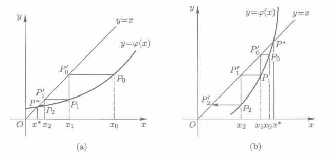
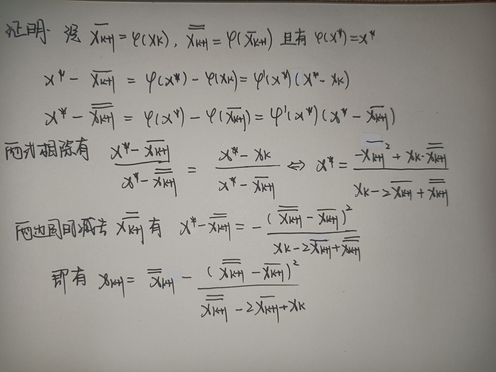
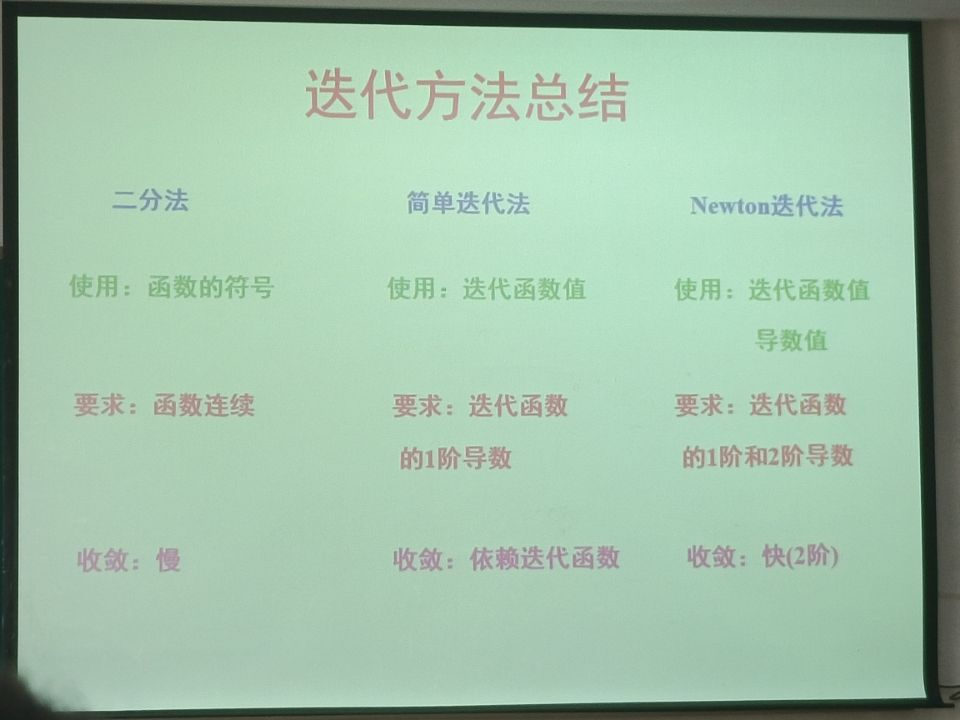

**目标问题**
$$
F(X) = 0
$$
此处$X = (x_1,x_2,\dots,x_n)^T ((x_i \in [a_i, b_i]))$

## 绪论

#### 单根

$$
f(x^*) = 0
$$

- $f(x) = (x- x^*)g(x)$
- $g(x) \neq 0$

#### 重根

$$
f(x^*) = 0
$$

- $f(x) = (x- x^*)^ng(x)$
- $g(x) \neq 0$

**称之为 n 重根**

#### 判别方法

$$
若 f(x^*) = 0, f'(x^*) = 0 , \dots ,f^{(n-1)}(0) = 0 且 f^{n}(x^*) =0
$$

则称$x^*是f(x) = 0$ 的**n重根**

#### 方程求根的三个步骤

- 根的存在性
- 根的隔离
- 根的精确比

## 二分法

- 设函数$f(x)$ 满足 $f(x) \in C([a,b]), f(a)f(b) < 0$ 则据闭区间上的连续函数性质可知方程$[a,b]$内一定有根，称$[a,b]$为方程的**有根区间** 

- 若方程在$[a,b]$内有唯一的根，则称其为方程的**隔离区间**

#### 计算过程

- 将区间$[a,b]$二等分并且记$x_0=\frac{1}{2}(a+b)$作为新的计算值，并且记$x^* $为区间内唯一实根

- 若$f(x_0) = 0$ 则求得实根 $x^* = x_0$

- 若$f(x_0)$与$f(a)$ 和$f(b)$ 异号

  - 若$f(a)f(x_0) <0$ 则根在区间$[a,x_0]$内 并且取 $a_1 = a ,b_1 =x_0 $
  - 若$f(x_0)f(b) <0$ 则根在区间$[a,x_0]$内 并且取 $a_1 = x_0 ,b_1 =b $

- 不断重复上述二分步骤，可得到序列区间$[a_0,b_0] \supset [a_1,b_1] \supset[a_2,b_2]\supset \dots \supset [a_k,b_k] \supset \dots$

  其中二分k次后的区间$[a_k,b_k]$ 的长度为 $b_k-a_k= \frac{1}{2^k}(b-a)$

- 若要求精度为$|x^*-x^k|<\epsilon$ 则需要 

$$
K> \frac{ln(b-a)-ln(2\epsilon)}{ln2}
$$

#### 优点和缺点

- 计算过程简单
- 函数要求低
- 没有充分利用好所求的值，只是计算了正负没有用到具体的值

## 弦截法

$$
x_{K+1} = x_K - \frac{x_k - x_{x-1}}{f(x_k)-f(x_{k-1})}f(x_k), k = 1,2,\dots
$$

#### Steffensen方法

$$
x_{k+1} = x_k - \frac{f^2(x_k)}{f(x_k)-f(x_k-f(x_k))}, k = 1,2,\dots
$$

一般而言，Steffensen方法收敛速度快于弦截法，但是与初始点选取有关

## Picard迭代法

设非线性标量方程可以写成

$$
x = \varphi(x), x\in [a,b]
$$
利用图示法可以表示如下：

#### 收敛定理1

若函数 $\varphi(x)$满足如下条件

- 对于任意$x \in [a,b]$有 $a\leq \varphi(x) \leq b$
- 存在正数$q \le 1 $，使得对任意 $x \in [a,b]$,有 $|\varphi ' (x)| \le q \le 1$

则对任意初值$x_0 \in [a,b]$出发均收敛于方程的根，且有如下误差估计
$$
|x^* - x_k| \le \frac{q}{1-q}|x_k-x_{k-1}|
$$

#### 收敛定理2

设迭代函数$\varphi(x)$在方程的精确解$x^*$的某邻域内连续可微，且$|\varphi '(x)  | < 1$ 则称迭代格式是**局部收敛的**

## Aitken 加速迭代法

不妨设 $\overline{x_{k+1}} = \varphi(x_k)$ , $\overline{\overline{x_{k+1}}} = \varphi(\overline{x_{K+1}})$ 则有迭代公式：
$$
x_{k+1} = \overline{\overline{x_{k+1}}} - \frac{(\overline{\overline{x_{k+1}}} - \overline{x_{k+1}})^2} {\overline{\overline{x_{k+1}}}-2\overline{x_{k+1}}+x_k}
$$
证明如下：

## Newton 迭代法

### 基本思想

目标求解方程是$f(x) = 0$ 则令$f(x)$作为求解的目标有如下迭代公式：
$$
x_k = x_{k-1} - \frac{f(x_{k-1})}{f'(x_{k-1})}, k = 1,2,3,\dots
$$
本质上是用一次函数近似模拟了目标函数的下降趋势，并且**可以证明是二阶收敛**

### Newton 迭代方法推广

向量型Newton迭代公式：
$$
\mathbf{X_{k+1}} = \mathbf{X_k} - [F'(\mathbf{X_k})^{-1}]F(\mathbf{X_k})
$$
其中$F'(\mathbf{X})$表示向量函数的**雅可比行列式**

同样为节省每步计算jacobi矩阵的时间，有如下简化的Newton迭代公式
$$
\mathbf{X_{k+1}} = \mathbf{X_k} - [F'(\mathbf{X_0})^{-1}]F(\mathbf{X_k})
$$

### Newton迭代方法改进

考虑引入一个**下山因子**$\lambda: 0 < \lambda \le 1$， 从而产生Newton下山法:

 
$$
\mathbf{X_{k+1}} = \mathbf{X_k} -\lambda [F'(\mathbf{X_k})^{-1}]F(\mathbf{X_k})
$$
在实际计算中，$\lambda$可依次取$1,\frac{1}{2},\frac{1}{2^2},\dots,\frac{1}{2^k},\dots$

## 迭代方法的收敛阶

### P阶收敛

当$k \rightarrow inf $ 有
$$
\frac{|e_{k+1}|}{|e_k^p|}  \rightarrow C (C \neq 0, 且为常数)
$$
则称迭代过程是p阶收敛的

- 当$ p = 1, 0< C < 1$时，称作线性收敛
- 当 $1 < p < 2$ 时，称为超线性收敛
- 当 $p = 2$ 称作 平方收敛 

### 判断方法

设$\varphi(x)$在其不动点$x^*$的某邻域内p阶连续可微，且
$$
\varphi^{(i)}(x^*) = 0 (i = 1,2,\dots, p - 1),\varphi^{(p)}(x^*) \neq 0
$$
则可以判断是p阶收敛的

## 总结

