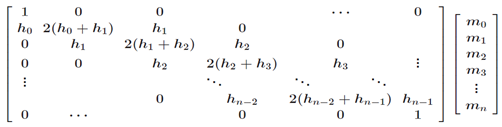
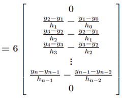
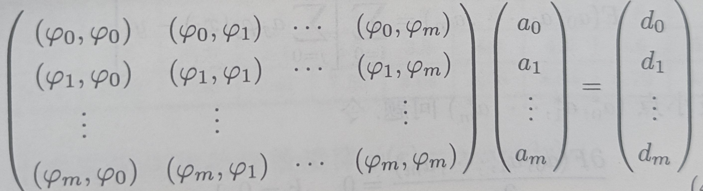
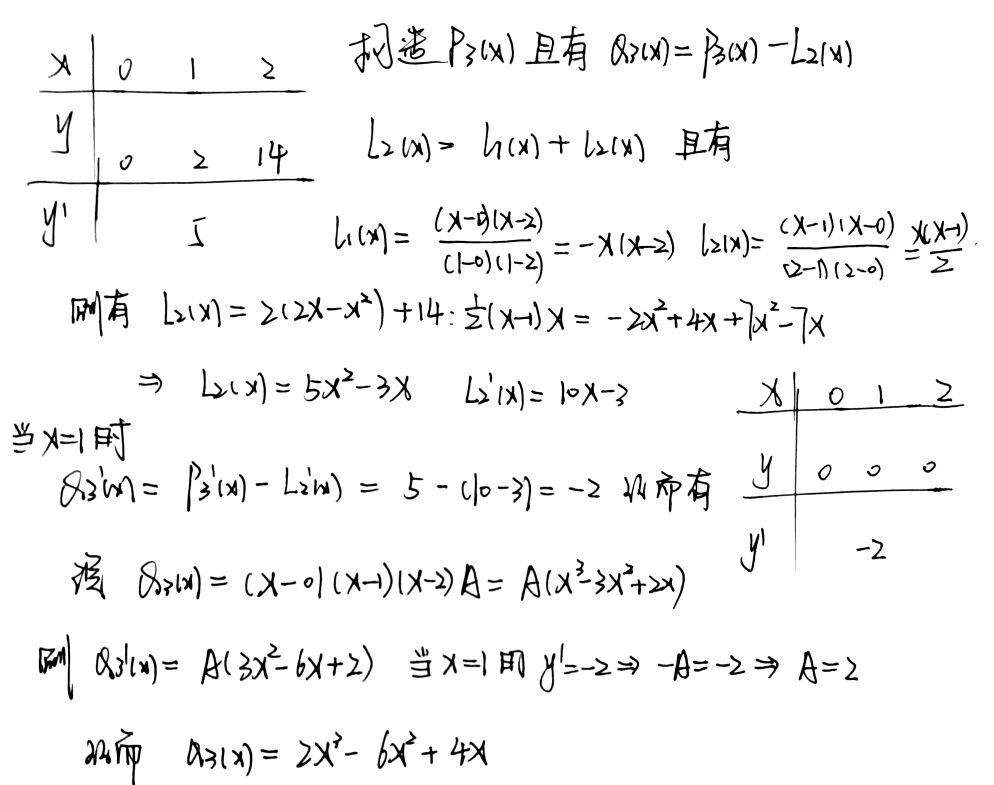

# Chapter 4 插值和曲线拟合方法

## 目标问题
求一个次数不超过n次的代数多项式：

$$P_n(x)  = a_0 + a_1 x + \cdots + a_nx^n$$

使其满足

$$P_n(x_i) = y_i , i = 0, 1, 2, \cdots, n.$$

甚至条件加强有

$$P_n^{(n)}(x) = val_i, i = 0, 1, 2, \cdots, n.$$

上述问题就是代数插值问题，$x_i$ 称为插值结点，所求的多项式称为
## Lagrange 插值

引入多项式 

$$l_j(x) = \prod_{i = 0, i \ne j } ^ n \frac{x-x_i}{x_j - x_i}$$
其中满足 
$$
l_j(x_i) = \delta_{ij} = 
\left \{
    \begin{aligned}  
        1,  i = j \\
        0, i \ne j  
    \end{aligned} 
\right. 
$$

代数插值问题的解 由下式给出：
$$ P_n(x) = \sum^{n}_{ j = 0 } y_j l_j(x) , x > 0$$
此公式可以称为 **线性插值公式**  或者 **抛物插值公式**

其中此公式的截断误差为
$$ R_n(x) = f(x) - P_n(x) = \frac{f^{(n+1)}(\psi)}{(n+1)!}\omega_{n+1}(x), x \in [a, b]$$
其中$\psi \in [x_i, x]$

我们可以进一步推出

$$|R_n(x)| \le \frac{M}{(n+1)!}|\omega_{n+1}(x)| $$
其中 $M = \max_{a\le x \le b } |f^{(n+1)}(x)|$

## Runge 现象 

虽然$P_{10}(x)$与被逼近函数$f(x)$ 在插值结点处取得相同的值，但是整体逼近效果很差，且越靠近端点的逼近效果越差，这种因为采取高次插值而产生较大误差的现象称为 **Runge（龙格）现象**

为解决这样的问题，可以考虑使用分段低次插值获得想要的点值

## Newton插值

### 差商

- 设$x_0, x_1, \cdots, x_n$为区间[a,b]上的互异结点，则$f(x_i)$ 在$f(x)$在$x_i$ 出的零阶差商；
- 称
$$\frac{f(x_i) - f(x_j)}{x_i - x_j}$$
为一阶差商
- 下式为n阶差商
$$f[x_0, x_1, \cdots, x_n] = \frac{f[x_0, x_1, \cdots, x_{n-1}] - f[x_1, x_2, \cdots, x_{n}]}{x_0 - x_n}$$

### newton 插值表达式

由差商公式我们可以得到 newton 差商公式
$$N_n(x) = f(x_0) + f[x_0, x_1](x - x_0) + \cdots + f[x_0, x_1, \cdots, x_n] \omega_n(x)$$
$$R_n(x) =f[x_0, x_1, \cdots, x_n] \omega_{n+1}(x)$$
$$\omega_{n}(x) = \prod^{n-1}_{i = 0} (x - x_i)$$

并且我们可以得到 
$$N_n(x) = P_n(x), \forall x \in [a, b]$$
其截断误差是
$$R_n(x) = f(x) - N_n(x) = \frac{f^{(n+1)}(\psi)}{(n+1)!} \omega_{n+1}(x) , x \in [a, b]$$

## Hermite 插值

问题加强，我们不仅要求在插值点的函数值相同，同时要求二者的导数值在各个节点相同
即
$$H^{(j)}(x_i) = f^{(j)}(x_i), j = 0,1, \cdots , m_i; i = 0, 1, \cdots, n.$$
这样的办法称为 Hermite 插值法

我们可以取
$$a_j(x) = l_j^2(x), b_j = l'_j(x_j) = \sum ^n _{i = 0, i \ne j} \frac{1}{x_j - x_i}$$
由此可以得到
$$H_{2n+1}(x) = \sum_{j = 0} ^ {n} [y_j + (x - x_j)(y'_j - 2y_jl'_j(x_j))]l^2_j(x)$$
其中 $l_j(x) = \prod_{i = 0, i \ne j } ^ n \frac{x-x_i}{x_j - x_i}$

其截断误差为
$$R_{2n+1}(x) = f(x) - H_{2n+1}(x) = \frac{f^{(2n+2)(\psi)}}{(2n+2)!}\omega^2_{n+1}(x), \forall x \in [a, b]$$

#### 缺项情况见相关例题

## 样条插值

一般情况下 我们考虑用三次样条插值$S(x)$来逼近函数$f(x)$, 记
$$y_k = f(x_k), y'_k = f'(x_k) , y''_k = f''(x_k), k = 0, 1, \cdots, n.$$
并且有
如果有 n + 1 个结点 $x_0, \cdots, x_n$ 那么一共有n个分段，即 4n 个未知参数
其中每个分段两端的值已知，所以有n个分段，因此有2n个已知等式
$$s(x_i) = f(x_i)$$
剩下还要限制两个相邻分段在边界上的一阶和二阶导数连续，一共2*(n-1)个已知等式，因为只有n-1个边界
$$s'_{-}(x_i) =s'_{+}(x_i) $$
$$s''_{-}(x_i) = s''_{+}(x_i), i = 1, \cdots, n-1 $$
剩余两个条件有 
$$ S'(x_0 + 0) = y'_0 , S'(x_n - 0) = y'_n $$
来确定，并且称为Ⅰ型插值问题

算法概述:
假设有 $n+1$ 个数据节点
$$(x_0,y_0), (x_1, y_1), (x_2, y_2), \cdots, ( x_n, y_n)$$
1. 计算步长$h_i = x_{i+1} - x_i (i = 0, 1, \cdots, n-1)$
2. 将数据节点和指定的首尾端点条件带入矩阵方程
 = 

1. 求解矩阵方程，求得二次微分值$m_i$, 该矩阵是三对角矩阵，考虑使用追赶法求解
2. 计算样条曲线的系数 $a_i = y_i, b_i = \frac{y_{i+1} - y_i}{h_i} - \frac{h_i}{2} m_i - \frac{h_i}{6}(m_{i+1} - m_i), c_i = \frac{m_i}{2}, d_i = \frac{m_{i+1} - m_i} {6h_i}$
3. 在每个子区间中，创建方程  $g_i(x) = a_i + b_i (x - x_i ) + c_i (x-x_i)^2 + d_i (x - x_i) ^3$

## 最小二乘法

在很多问题中我们都希望尽可能将拟合函数的误差尽可能的变小，其本质是一种多元函数求极值的问题，我们不妨考虑将拟合函数记成一系列多项式函数的线性组合：

设基函数为:
$$\phi_j(x) = x^j ( j = 0, 1, 2 \cdots, n ) $$

则拟合函数可以写成 
$$\Phi_n(x) = \sum _{i = 0}^n a_i \phi_i(x)  = \sum _{i = 0}^n a_i x^i$$

规定：
$$(\phi_k, \phi_j) = \sum_{i = 0}^n \phi_k(x_i)\phi_j(x_i) $$
$$d_k = \sum_{i = 0}^n \phi_j(x_i) $$

则只需要求解基函数的系数即可，即求解方程组得到相关系数即可

## 相关例题

